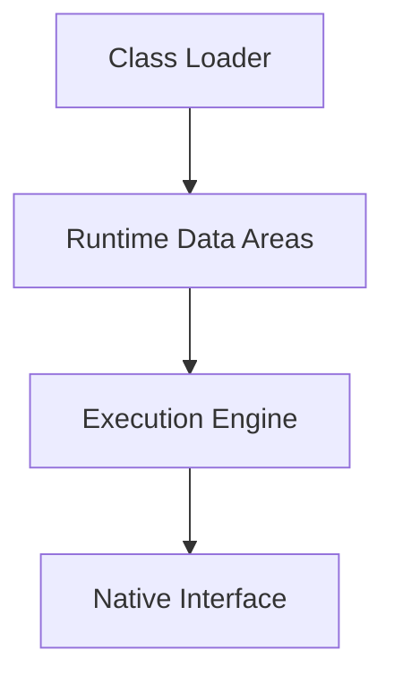
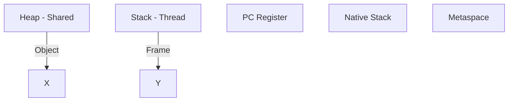

# 1. JDK vs JRE vs JVM (Bản tối giản dễ nhớ)

## 🔥 So sánh nhanh

| Layer | Bao gồm          | Dùng để làm gì | Định nghĩa ngắn                  |
| ----- | ---------------- | -------------- | -------------------------------- |
| JDK   | JRE + Tools      | Dev            | Bộ công cụ để lập trình Java     |
| JRE   | JVM + Libraries  | Run            | Môi trường để chạy ứng dụng Java |
| JVM   | Execution Engine | Execute        | Máy ảo thực thi bytecode         |

---

## 🔥 Dependency Diagram (Cốt lõi)

```
JDK
 └── JRE
      └── JVM
```

---

## 🔥 Flow thực tế

```
.java → javac → .class → JVM → OS
```

---

# 2. JVM Architecture (Diagram-first)

## 🔥 Tổng thể



---

# 3. ClassLoader (Table hóa)

## 🔥 Delegation Model

| Level | Loader      | Vai trò               | Định nghĩa ngắn                |
| ----- | ----------- | --------------------- | ------------------------------ |
| 1     | Bootstrap   | Load core (java.lang) | Loader gốc, load thư viện Java |
| 2     | Platform    | Load extension        | Load thư viện mở rộng          |
| 3     | Application | Load app code         | Load code của ứng dụng         |

---

## 🔥 Lifecycle

| Step    | Mô tả                      | Định nghĩa ngắn     |
| ------- | -------------------------- | ------------------- |
| Loading | Load file .class           | Đọc file bytecode   |
| Linking | Verify + Prepare + Resolve | Kiểm tra & chuẩn bị |
| Init    | Chạy static block          | Khởi tạo class      |

---

# 4. Memory Model (CỰC QUAN TRỌNG)

## 🔥 Tổng quan



---

## 🔥 So sánh vùng nhớ

| Memory       | Scope  | Chứa gì        | Lỗi thường gặp | Định nghĩa ngắn      |
| ------------ | ------ | -------------- | -------------- | -------------------- |
| Heap         | Shared | Object         | OOM            | Nơi lưu object       |
| Stack        | Thread | Method call    | StackOverflow  | Nơi chạy hàm         |
| Metaspace    | Shared | Class metadata | OOM Metaspace  | Lưu thông tin class  |
| PC           | Thread | Instruction    | -              | Con trỏ lệnh         |
| Native Stack | Thread | Native call    | -              | Stack cho code C/C++ |

---

## 🔥 Heap Structure (Quan trọng nhất)

```
Heap
 ├── Young Gen
 │    ├── Eden
 │    ├── S0
 │    └── S1
 │
 └── Old Gen
```

---

## 🔥 Object Lifecycle

| Bước | Mô tả               | Định nghĩa ngắn |
| ---- | ------------------- | --------------- |
| 1    | new → Eden          | Object mới tạo  |
| 2    | Minor GC → Survivor | Object sống sót |
| 3    | Sống lâu → Old Gen  | Object lâu dài  |
| 4    | Full GC             | Dọn toàn bộ     |

---

# 5. Execution Engine

## 🔥 Thành phần

| Component   | Vai trò            | Định nghĩa ngắn          |
| ----------- | ------------------ | ------------------------ |
| Interpreter | Chạy từng dòng     | Thực thi chậm, trực tiếp |
| JIT         | Optimize & compile | Biên dịch sang native    |
| GC          | Dọn bộ nhớ         | Thu hồi object           |

---

# 6. Garbage Collection (Table hóa)

## 🔥 Loại GC

| GC Type  | Scope | Định nghĩa ngắn  |
| -------- | ----- | ---------------- |
| Minor GC | Young | Dọn object mới   |
| Major GC | Old   | Dọn object lâu   |
| Full GC  | All   | Dọn toàn bộ heap |

---

## 🔥 Algorithm

| Algorithm    | Ý nghĩa        | Định nghĩa ngắn       |
| ------------ | -------------- | --------------------- |
| Mark-Sweep   | Đánh dấu + xóa | Xóa object không dùng |
| Mark-Compact | Dồn memory     | Gom bộ nhớ            |
| Generational | Phân thế hệ    | Chia heap theo tuổi   |

---

# 7. Java Version Changes (RẤT HAY HỎI)

| Version | Change        | Định nghĩa ngắn             |
| ------- | ------------- | --------------------------- |
| Java 7  | PermGen       | Vùng chứa metadata cũ       |
| Java 8+ | Metaspace     | Metadata dùng native memory |
| Java 9+ | Module system | Bỏ rt.jar, dùng module      |

---

# 8. Troubleshooting (Interview killer)

## 🔥 Error Mapping

| Error              | Root Cause       | Định nghĩa ngắn  |
| ------------------ | ---------------- | ---------------- |
| StackOverflowError | Recursion        | Tràn stack       |
| OOM Heap           | Too many objects | Hết heap         |
| OOM Metaspace      | Too many classes | Hết metadata     |
| GC Overhead        | GC quá nhiều     | GC chạy liên tục |

---

## 🔥 Memory Leak Pattern

| Case              | Ví dụ        | Định nghĩa ngắn      |
| ----------------- | ------------ | -------------------- |
| Static giữ ref    | static List  | Object không được GC |
| Cache không clear | Map          | Giữ dữ liệu lâu      |
| Listener          | không remove | Leak do callback     |

---

# 9. 1-Page Summary (Ôn nhanh trước interview)

## 🔥 Core Map

```
JDK
 └── JRE
      └── JVM
           ├── Heap
           ├── Stack
           ├── Metaspace
           └── GC
```

---

## 🔥 Key bullets

* Heap = Object → nơi lưu dữ liệu

* Stack = Method → nơi chạy logic

* Metaspace = Class → nơi lưu metadata

* GC:

  * Minor → nhanh
  * Full → chậm

* Java không leak memory ❌
  → Sai: vẫn leak nếu còn reference

---

# 10. Upgrade thêm (nếu muốn level Senior)

## 🔥 Nên thêm:

* G1 GC (default)

* ZGC (low latency)

* JVM tuning:

  * -Xms → initial heap
  * -Xmx → max heap
  * -XX:MaxMetaspaceSize → metaspace limit

---
